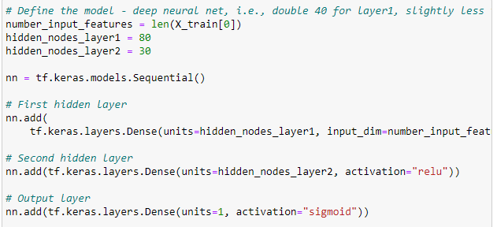
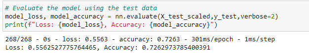

# Neural Network Charity Analysis
In this challenge, Beks needs help developing a neural network that can predict if an applicant will be successful upon being funded by Alphabet Soup. With a detailed list of organizations that have been funded and which have been successful (money used effectively), I created multiple neural networks to attempt to predict which future applicants would use the funded money effectively.

## Results
To build these networks, the data needed to be preprocessed in order for the neural model to be able to use the data. The highlights of the preprocessing are:
- The targeted variable that determines success is the "IS_SUCCESSFUL" variable.
- The features targeted by the model would be every other variable, apart from IS_SUCCESSFUL. In order to get this list, we simply dropped the IS_SUCCESSFUL column.
- There were two columns that were dropped from the data that would introduce noise and have no positive impact on the model. Those columns were EIN and NAME

With the data processed, I could compile, train, and evaluate the model:
- In my first model, I started with two layers, as to not overcomplicate the model. The first layer had 80, which was about double the amount of inputs. The second layer had 30 layers, and this was to keep the model from becoming too resource intensive. Finally there was an output layer with 1 unit. The first two layers utilized a ReLu activation to not limit positive outcome, and the output layer utilized Sigmoid as we are predicting a dichotomous outcome (1 of 2 possible outcomes).

- 
