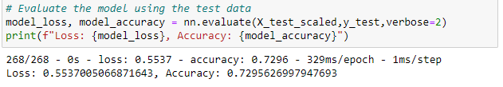

# Neural Network Charity Analysis
In this challenge, Beks needs help developing a neural network that can predict if an applicant will be successful upon being funded by Alphabet Soup. With a detailed list of organizations that have been funded and which have been successful (money used effectively), I created multiple neural networks to attempt to predict which future applicants would use the funded money effectively.

## Results
To build these networks, the data needed to be preprocessed in order for the neural model to be able to use the data. The highlights of the preprocessing are:
- The targeted variable that determines success is the "IS_SUCCESSFUL" variable.
- The features targeted by the model would be every other variable, apart from IS_SUCCESSFUL. In order to get this list, we simply dropped the IS_SUCCESSFUL column.
- There were two columns that were dropped from the data that would introduce noise and have no positive impact on the model. Those columns were EIN and NAME

With the data processed, I could compile, train, and evaluate the model:
- In my first model, I started with two layers, as to not overcomplicate the model. The first layer had 80, which was about double the amount of inputs. The second layer had 30 layers, and this was to keep the model from becoming too resource intensive. Finally there was an output layer with 1 unit. The first two layers utilized a ReLu activation to not limit positive outcome, and the output layer utilized Sigmoid as we are predicting a dichotomous outcome (1 of 2 possible outcomes).

- The inital model did no meet our target accuracy (75%), but it came close. Next, I attempted to optimize the performance of the model.
- First, I looked at the data to see if I could help minimize noise. I specifically looked at ASK_AMT, since many of the other fields were dichotomous, to see if I could bin. It turned out that there was significant variety in the ask amounts, with most amounts only having 1 instance. I decided to bin this data into 5 bins to see if that impacted the outcome of the model. I did have to convert the bins into string format and OneHotEncode/merge into the dataframe.

- After further processing the data, I made several adjustments to the model to see if I could reach 75% accuracy.
- The first attempt was to simply add more neurons to my model

- The second attempt was to add another hidden layer to my model

- The final attempt was to change the activation method to leaky ReLu

- I will note that the initial model performed better than the first two optimization attempts, but the best performer was the leaky ReLu model, achieving a 72.96% accuracy score. The reason I initally chose to use Leaky_ReLu is to prevent neurons from potentially only outputting 0 and affecting the weights. It seemed to have a positive impact, although small.

## Summary
The overall results of my model did not meet our target accuracy, which
